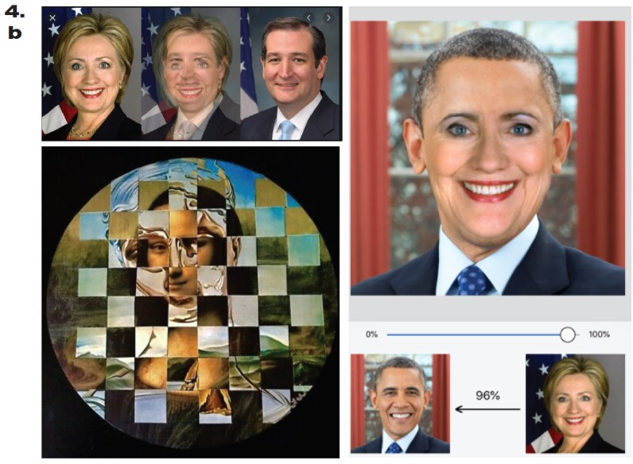

# 

**Table of contents**

[TOC]

# The Artefact 

The chosen artefact is a linocut poster by Semi Ruder from 1984, Netherlands. It was made during the time when the person identification number was about to be introduced as a centralized human accounting system, and wide protests spread across the country. The chosen poster is one of many opinions against this centralized data collection.

| Tag                                                          | Data                                                         |
| ------------------------------------------------------------ | ------------------------------------------------------------ |
| IISG Call Number                                             | IISG BG D82/183                                              |
| Physical Description                                         | Paper poster, 63x45cm, linocat, two color print              |
| Type                                                         | Object                                                       |
| Medium                                                       | Poster, linocut                                              |
| Materials                                                    | Paper, ink                                                   |
| Date                                                         | 1984                                                         |
|  | The poster is printed in two color layers - brown-red and black.  On the poster a woman is depicted, and all across the poster are written seemingly random numbers. They are also going over the women's portrait. All of this is printed in red-brown color. Then, the exact same composition is turned upside down and printed in black, on top of the first layer. |

# The Research

## 1. Previously considered topics and objects

#### 1.2. Year Without Summer (1816)

[Year Without Summer 1816]: https://www.theguardian.com/music/2016/jun/16/1816-year-without-summer-dark-masterpieces-beethoven-schubert-shelley

> “The impact of what is now known as seasonal affective disorder is seldom identified and never analysed in artistic activity”

#### 1.3. Doctor's strike in Netherlands

1950's.

[Protest apron of a doctor]: https://search.iisg.amsterdam/Record/995150

[Doctor's strike in Netherlands (1950's)]: https://www.gewina-studium.nl/articles/10.18352/studium.8818/print/

#### 1.4. Espionage

Roles in Espionage:
In most countries there are separate secret services in charge of espionage for national security. Such secret services can be subdivided into security services, intelligence services, eavesdropping services and military intelligence services. Employees who are employed by a secret service are called intelligence officers. Persons who possibly provide information for a financial fee but are not on the payroll are called agents.
In addition, there are informers who provide information to officers or agents without consideration and on their own initiative. Double spies are agents who provide intelligence officers on both sides with information, while a mole is an agent who deliberately infiltrates a hostile intelligence organization.

Komitee Anti Kontrole (Utrecht), 1978, Hoog Catharijne (Utrecht)

OSINT (Open Source Intelligence): information from public sources
HUMINT (Human Intelligence): intelligence from human sources ("spies")
SIGINT (Signals Intelligence): information from electronic signals ("eavesdropping")
IMINT (Imagery Intelligence): intelligence from aerial photos and satellite images
GEOINT (Geospatial Intelligence): information from various sources presented on maps
CLASSINT (Classified Information Intelligence): intelligence from secret information from partner services
MEDINT (Medical Intelligence): information in the medical field
FININT (Financial Intelligence): information from financial sources
TRAVINT (Travel Intelligence): information from travel data

http://www.iisg.nl/staatsarchief/affiches/acties-divers.php#politie

https://search.iisg.amsterdam/Search/Results?sort=relevance&join=AND&lookfor0%5B%5D=staatsarchief&type0%5B%5D=AllFields&lookfor0%5B%5D=politie&type0%5B%5D=AllFields&bool0%5B%5D=AND&filter%5B%5D=format%3A%22Visual+documents%22&limit=50&daterange%5B%5D=publishDate&publishDatefrom=&publishDateto=

Various materials on privacy and police force in Netherlands
https://search.iisg.amsterdam/Search/Results?sort=relevance&join=AND&lookfor0%5B%5D=staatsarchief&type0%5B%5D=AllFields&lookfor0%5B%5D=politie&type0%5B%5D=AllFields&bool0%5B%5D=AND&filter%5B%5D=format%3A%22Visual+documents%22&limit=50&daterange%5B%5D=publishDate&publishDatefrom=&publishDateto=

#### 

1.5. Objects of Interest

- Caricature Koos Barten, Staatsarchief (Amsterdam), 1975-1999
  https://search.iisg.amsterdam/Record/1211405

- Caricature Koos Barten, Staatsarchief (Amsterdam), 1975-1999
  https://search.iisg.amsterdam/Record/1211274

- Caricature Koos Barten, Staatsarchief (Amsterdam), 1975-1999
  https://search.iisg.amsterdam/Record/1211281

- Caricature Koos Barten, Staatsarchief (Amsterdam), 1975-1999, https://search.iisg.amsterdam/Record/1211311 , https://search.iisg.amsterdam/Author/Home?author=Klachtenburo+Politie-optreden+%28Amsterdam%29

- Kwaad op je beste kameraad?, Ahlfeld, Jean-Marcel, 1982-1982
  https://search.iisg.amsterdam/Record/835068

- Caricature Koos Barten, Staatsarchief (Amsterdam), 1975-1999
  https://search.iisg.amsterdam/Record/1211363

- Button, United Kingdom, 
  https://search.iisg.amsterdam/Record/1186192

- Dubois, A., 42/60 (Bruxelles), 1976-1976, poster
  https://search.iisg.amsterdam/Record/843386

- Various publications about police, security services, government control in 1988-2005
  http://www.iisg.nl/staatsarchief/archieven/algemeen/politdos.php

- Against identification and identification obligation
  Material: pamphlets, publications from the Netherlands.
  (1988-1989, 2002-2003, 2007-2008, 2010)
  People: Holvast, Jan; Prakken, mr. Ties; Regtien, Ton; Ritsema, Geert; Rust, Friso; Shaving, Jos
  Organizations: NN (per); An Evil Living Foundation; Stichting Vaakaak Persoonsregistratie; XminY; Free bit. Newspaper on the occasion of Electronic media Monitoring 2002.

  http://www.iisg.nl/staatsarchief/archieven/algemeen/politdos.php
  1968-1999. 

  Various publications about police, security services, government control and bajus
  (SAVRZ058 Box 001 Folder 000), 1977-1998
  Keywords: jail struggle, infiltrators, blurring of standards, government control, police action
  Geographical subject: The Netherlands: Amsterdam: Scheveningen {Penal Prison}: Utrecht: Zaandam
  Peopl: Bos, Sjoerd (o); Hester, Lex; Holvast, Jan
  Organizations: Antinor; Koninginneweg (Amsterdam); Tilburg University; Jansen & Janssen; Police Complaints Office (Amsterdam); Anti-Control Committee; Ministry of Internal Affairs; Wall paper Utrecht; Dutch Police Academy; Stichting Vaakaak Persoonsregistratie; Ravijn publishing house. 

  In this box the following publications: "Kraken and police or Who is the boss of the mess?", Dutch Police Academy, Apeldoorn Oct. 1978; of this also a completely revised second edition: "Kraken and police", Apeldoorn 1980. From the Amsterdam Police Complaints Office: "Anthology from the complaints and an overview of the work", October 1977; furthermore the Annual Reports of 1984 and 1985, and "A year of Amsterdam cover-up", Asd 1978. "Serves the servant? A bundle of articles about the police, violent acts and information violence, alienation, specialization and verifiability", compiled by Jan Breed and Bert Rombouts, Katholieke Hogeschool Tilburg, 1979. "The large-scale police appearance after 1980. Report of the study conference on the Mobile Units of state and municipal police and the assistance units of the Weapon of the Royal Netherlands Marechaussee, January January 1981. "Hey, you there! -APV-file", issued as a warning against the new General Local Police Regulation in Amsterdam, effective from 1-3-83. "Raincoat democracy. BVD infiltrations at activist / sters", by Buro Jansen & Janssen, Amsterdam 1990. "Slit hats! The activities of BVD and PID in the Zaanstreek", by BIPS, Zaandam 1991. "Help against the cop", by Muurkrant Utrecht. "Zorro strikes! Security industry, camera control and the report of an action in Hoog Catharijne", Utrecht, December 1977. " "Bunker Balen Boek" (about the B-wing of the Scheveningen prison), by Stichting Vrij and the BWO in Amsterdam, 1983. "Privacy and Registration", publication of Stichting Waakzaamheid Persoonsregistratie, nrs. 2 and 4, Amsterdam 1988. Further three so-called "value envelopes" from the Amsterdam police regarding three anonymous detainees during the evictions on 16-6-98 in Amsterdam; the items that are arrested are kept in these plastic bags with a description of the contents "Bunker Balen Boek" (about the B-wing of the Scheveningen prison), by Stichting Vrij and the BWO in Amsterdam, 1983. "Privacy and Registration", publication of Stichting Waakzaamheid Persoonsregistratie, nrs. 2 and 4, Amsterdam 1988. Further three so-called "value envelopes" from the Amsterdam police regarding three anonymous detainees during the evictions on 16-6-98 in Amsterdam; the items that are arrested are kept in these plastic bags with a description of the contents Furthermore, three so-called "value envelopes" from the Amsterdam police regarding three anonymous detainees during the evictions on 16-6-98 in Amsterdam; the items that are arrested are kept in these plastic bags with a description of the contents Furthermore, three so-called "value envelopes" from the Amsterdam police regarding three anonymous detainees during the evictions on 16-6-98 in Amsterdam; the items that are arrested are kept in these plastic bags with a description of the contents

- Forty years of Dutch action posters from 1965 to 2005
  http://www.iisg.nl/staatsarchief/publicaties/emmer-kwast-inhoud.php

- George, Susan, US, button – https://search.iisg.amsterdam/Record/1463607

- UK, https://search.iisg.amsterdam/Record/1186196

- Halmos P., “Solitude and privacy : a study of social isolation : its causes and therapy.”
  https://search.iisg.amsterdam/Record/583113

- Book: Obfuscation

  How we can evade, protest, and sabotage today's pervasive digital surveillance by deploying more data, not less—and why we should. – https://mitpress.mit.edu/books/obfuscation / https://search.iisg.amsterdam/Record/1507083

  They are calling us not to the barricades but to our computers, offering us ways to fight today's pervasive digital surveillance—the collection of our data by governments, corporations, advertisers, and hackers. To the toolkit of privacy protecting techniques and projects, they propose adding obfuscation: the deliberate use of ambiguous, confusing, or misleading information to interfere with surveillance and data collection projects. Brunton and Nissenbaum provide tools and a rationale for evasion, noncompliance, refusal, even sabotage—especially for average users, those of us not in a position to opt out or exert control over data about ourselves. Obfuscation will teach users to push back, software developers to keep their user data safe, and policy makers to gather data without misusing it.
  Brunton and Nissenbaum present a guide to the forms and formats that obfuscation has taken and explain how to craft its implementation to suit the goal and the adversary. They describe a series of historical and contemporary examples, including radar chaff deployed by World War II pilots, Twitter bots that hobbled the social media strategy of popular protest movements, and software that can camouflage users' search queries and stymie online advertising. They go on to consider obfuscation in more general terms, discussing why obfuscation is necessary, whether it is justified, how it works, and how it can be integrated with other privacy practices and technologies.

- State Commission for the protection of privacy in connection with personal registration. Privacy and personal registration: final report, 448 p., dutch language, The Hague: Staatsuitgeverij, 1976
  https://search.iisg.amsterdam/Record/1289898

- Police and privacy: investigation into erroneous provision of information by the police: report of the survey by the committee on judicial documentation and police records. Den Bosch: Association of probation institutions, 1976.
  https://search.iisg.amsterdam/Record/595424
- Who is watching you?, 1985, Lubbers, Ruud Nijpels, Ed Janmaat, Hans. https://search.iisg.amsterdam/Record/1289746
- 1982-1984, https://search.iisg.amsterdam/Record/1212542 , https://search.iisg.amsterdam/Record/1211209

Zondere nummer bestaat men niet?** (You don’t exisst without a number?), Seidel, Rudi, 1984. Woodcut; 63x45 cm.  https://search.iisg.amsterdam/Record/1311546

- 
 
 1.2.Rudi Seidel 

Rudi Seidel (born 1938) is without a doubt one of the most striking artists from Drenthe. As a painter, draftsman and graphic artist, he has always endeavored to convey a socially critical message with his work. For the most part autodidact, he developed an expressive figurative design with a very clear own face.

Artist Rudi Seidel makes posters for anti-Nuclear movements, anti-racism, anti-militarism, social unrest, freedom of speech. Other posters: https://search.iisg.amsterdam/Author/Home?author=Seidel%2C+Rudi%2C&type=Author&page=2

12 woodcuts of Rudi Seidel
https://search.iisg.amsterdam/Record/1311657
https://search.iisg.amsterdam/Record/1311653
https://search.iisg.amsterdam/Record/1310723

 

## 2. History of Privacy in Netherlands

Privacy emerged on the policy agenda in the late 1960s. Privacy law and policy can be roughly divided into two periods: two decades of creating general privacy frameworks in the Constitution and comprehensive data protection legislation, and two decades of updating these general frameworks in light of technological developments while also passing many privacy-diminishing laws to serve other policy goals.
The rise of the information society, the network society, and the risk society can explain a privacy policy change occurring somewhere during the 1980s. This change can be interpreted either as a shift from generally privacy-friendly policy to generally privacy-unfriendly policy, or as a shift in focus from general, privacy-centric framework regulation to specific, privacy-unrelated legislation targeted at other, higher-ranking policy goals, such as organized crime, immigration, and health and safety.

- Technology and Privacy: The New Landscape
  https://books.google.nl/books?id=H2KB2DK4w78C&pg=PA154&lpg=PA154&dq=privacy+issues+netherlands+1980&source=bl&ots=1X-gsgYwJq&sig=ACfU3U2XovaqriyvMenUTCFuJFOTPmQqVQ&hl=en&sa=X&ved=2ahUKEwiFtNvs2N_nAhWEzqQKHYAACyIQ6AEwAnoECAoQAQ#v=onepage&q=privacy%20issues%20netherlands%201980&f=false

- Stichting Waakzaamheid (IISG Archive), active in 1970’s
  https://search.iisg.amsterdam/Record/1341703
  Gemeente en privacy : een rapport over gemeentelijke persoonsregistraties
  https://search.iisg.amsterdam/Record/157845 , https://search.iisg.amsterdam/Record/1315369

Dutch Data Protection Authority (Dutch: Autoriteit Persoonsgegevens, AP –independent administrative body that has been appointed by law as the supervisory authority for the processing of personal data.

The Personal Data Protection Act means that an organization may only process personal data that is demonstrably necessary for the organization and for which no explicit prohibition exists. Examples of this are medical, sexual, political data and data about membership of a trade union. For governments, the term 'demonstrably necessary' means that there must be a legal basis for the processing of data

- Article 51 of the Personal Data Protection Act
  https://wetten.overheid.nl/BWBR0011468/2016-01-01#Hoofdstuk9_Paragraaf1_Artikel51

> “In the Netherlands, moreover, more needs to be done about the position of civil law organisations, the number of privacy officials, certification of the security of personal data and the dialogue issuing from the Personal Data Authority.” – Leiden Law School research, https://www.universiteitleiden.nl/en/news/2017/09/the-netherlands-one-of-the-leaders-in-privacy-protection

https://www.security.nl/
https://www.security.nl/posting/634145/Alternatief+Google+foto

## 3. Social Context of The World in 1970

- Anti-war movements, memory of Nazism still on (regarding centralized data collection), 
- Fighting for womens rights (America), 
- Environmentalism, 
- USA president R.Nixon impeached, 
- In USA, after Watergate (R.Nixon scandal), people withdraw from politics altogether and turns to pop-culture, liberation movements.

http://www.thepeoplehistory.com/1970.html / https://edition.cnn.com/2015/05/21/world/gallery/70-historic-moments-from-the-1970s/index.html / https://www.history.com/topics/1970s/1970s-1

## 4. Privacy nowadays in Netherlands

“You do this by identifying and analyzing network threats and technical security risks. You therefore have a keen eye for the vulnerabilities in the IT infrastructure, monitor these and act on incidents. You also coordinate - and advise on - vulnerability analyzes and penetration tests. And you also make your own analyzes. You are also a member of the cyber security incident response team. In your role you are constantly working on the mutual translation between tactical issues and implementation. In this way you contribute to the formulation of the information security policy and you work towards standards, supporting guidelines, procedures and baselines for information security.“

[^https://www.forensischinstituut.nl/wetenschap-innovatie/wetenschappelijke-publicaties]: Forensisch Instituut

https://www.forensischinstituut.nl/wetenschap-innovatie/wetenschappelijke-publicaties/archief/wetenschappelijke-publicaties-1993

- External and research activities of NFI
  (PDF) file:///D:/Users/User/Pictures/KABK/YEAR%203/IMD/Semester%202/Archiving/Didier+Meuwly+-+External+and+Research+Activities.pdf

Privacy Laws in Netherlands
https://www.ivpn.net/internet-privacy-laws-in-the-netherlands The Dutch government conceded that due to the court’s decision providers would therefore not be required to store data for the purpose of investigations. Unsurprisingly, the Dutch authorities showed serious concern that the decision would seriously affect the ability of authorities to “fight crime”[2]. The ministry is seriously concerned about the effect this will have on fighting crime.” (https://www.theguardian.com/technology/2015/mar/12/data-retention-netherlands-court-strikes-down-law-as-breach-of-privacy) more that 4 yrs old article

Spies Next Door: Operation Ghost Stories (Declassified) | History Documentary | Reel Truth History
https://www.youtube.com/watch?v=hQKn27dJFpI

IISG Archive visit
https://search.iisg.amsterdam/Record/1311546

## 5. Analyzing the Original Poster

#### Semi Ruder poster observation from the original.

Color
 
Layer 1 – matt color (reddish, dark brown). Texture is more grainier than layer 2. 
  Layer 2 – matt color, with a bit of a gloss. (black). Applied on top of the layer 1 color.    The layer 1 is visible through layer 2 as a texture and also the layer 1 see-through the layer 2 is a bit shinier that the layer 2.  

Texts on the poster
 
All across the poster are numbers randomly placed.
On the bottom horizontal, below the actual graphic are several texts:
“Zonder nummer bestaatmen niet?” (title), written with a graphite pencil, 3B or 2B softness unsharpened.  
1. “Rudi Seidel” (signature), written with a sharpened pencil, B softness, but the line is much thinner, therefore I suggest it i sharpened.  
2. “ ‘84 ” (year), written with a harder pencil, could be H hardness, sharpened, almost the lightest/thinnest line of all.  
3. “Tweesporesnveg I, 9403 EM Assen, tel. 0592017080” (contact information), written with the same pencil as the signature.  
  4. “N.a.v. persoonsregistratie” (comment), written the most lighter of all, but not sure if added by the artist or archivers.   

Paper
 
Paper is similar to Romandruk we have in school – yellowish, with a rougher texture than usual papers, with a lot more air in it (so appears thicker that the actual grammage). The weight of the paper could be around 120-140m3g, thinner than the usual poster papers.

Damages
 
  The poster has small pin-like holes in the corners of the poster. 1 in each upper corner and 2 irregular in each bottom ones. It gives a suggestion it has been pinned to a surface before.

Smell

Like an old book in a library.

Technique

Looks like linocut. Other posters are engraved in wood as well.

Other works in the folder
 
Anti Racisme poster (1985), U.S.A Neutronen Bom, Zwolle tegen de Neutronen-bom.Demonstreert: 11 Maart ‘78. Kies voof the vreede, kerer wapers nooitgevechtraardgd. Befehl ist Befehl, ‘80.

# Transcoding

In how many categories I can separate the poster?
    
1. Information mentioned  
2. Technique used to make it (woodcut)  
3. Materials used (what kind of paint, wood)  
4. Materiality (paper, how thick, fragile or not, rough or soft)  
5. Style (illustrative, rough)  
6. Smell  
7. Color (what color)  
8. Thickness of color  
9. Stains of unknown source, something that was not originally on the work  
10. Layers (how many, what color it is and what information contains)  
11. Handmade or digital work   

How to describe/translate this work (in words, numbers or any other technique)
  
WHY? 
A person would do this to make the work long-lasting and accessible to people that in the future migHt not access the work (either because the work is gone or the person is disabled in some way or the machine would need to reproduce it)  
HOW? 
Dragging the mouse along the illustration lines (involves an interpretation of the work by the person who does that). The line is noted as:  
1. a visual line  
2. coordinates in form of numbers (in this case the reproducible material is always placed on a before-made grid, so the base and coordinate system reference is always the same and multiple artworks are easily re-translatable back from the  “numbers” to possible original appearance  
3. placing dots on the edges of any  illustration/visual information. The more dots the more precise.  
4. Describing it with words (audial / written)  
5. Playing it with sounds / notes. (coordinate grid again should be the same, so that all the artworks can be translated via the same system)  
6. Throwing 1000 similar images from a google image database, that all togehter might reseble the original artwork  
7. many separate images given and the original is fantasized by the person via associations/styles/themes of given images  
8. combining/morphing/collaging 1000 images in one to recreate the original 
9. the poster is somehow re-printed in texture and the viewer can touch it and feel what is on it and where everything is placed  
10. The artwork is read in separate categories:   
		a. style of the work (handmade, illustrative, typographic poster,  
		b. abstract painting,  
		c. colors used, 
		d. texts on the poster indicated,  
  e. composition  

## Potential Startingpoints

#### Sketch No. 1: Location translation

#### Sketch No. 2: Written or spoken word 

#### Sketch No. 3: Audio

#### Sketch No. 4a: Found pictures thrown together to form associative original

#### Sketch No. 4b: Morphed found pictures together to create the original  

#### Sketch No. 5: Tangible translation

**Quesion 1** – How to preserve and present the vibe / mood of the work?
Method Nr.4 (a+b) – using the human ability to “connect dots” in associations – associative picture package

**Quesion 2** – How the way of transcoding refers to the the topic “Privacy”?

1. Traanscding could be visualised with numbers? other symbols? 
2. the privacy shows in the technique of transcoding –  in the sense that the work is never transcoded perfectly – it is always shown through a mediator that stands in between the original object and the person who wants to view it. The mediator being the visualisation the transcoding uses – and alternative to the original image, that tries to show the original image.

**Quesion 3** – What is the urgency of preserving this object?
There is no other concrete urgency than the topic itself. It is a symbolic artefact from the past that represents and talks about the issues of the present and the concerns of the future, communicated to the future.

**Quesion 4** – What does it mean to transcode “precisely”?
To bring across the visual, theme, the vibe of the work and the composition.

## Transcoding 1

The written description of the work
 
The poster smells like an old book in a library. Technique looks like a linocut, but other posters of the artist in the same folders are engraved in wood as well.  
The artwork is printed in two colors – black and red-brown(-ish). Layer 1 brown is a matt color (reddish, dark brown). Texture is more grainier than layer 2 black one.
Layer 2 is a black matt color, with a bit of a gloss. Applied on top of the layer 1. The layer 1 is visible through layer 2 as a texture and also the layer 1 is see-through the layer 2 is a bit shinier that the layer 2.  
All across the poster are numbers randomly placed. On the bottom horizontal, below the actual graphic are several texts: “*Zonder nummer bestaatmen niet?*” (title), written with a graphite pencil, 3B or 2B softness unsharpened. “*Rudi Seidel*” (signature), written with a sharpened pencil, B softness, but the line is much thinner, therefore I suggest it i sharpened. “*'84* ” (year), written with a harder pencil, could be H hardness, sharpened, almost the lightest/thinnest line of all. “*Tweesporesnveg I, 9403 EM Assen, tel. 0592017080*” (contact information), written with the same pencil as the signature. “*N.a.v. persoonsregistratie*” (comment), written the most lighter of all, but not sure if added by the artist or archivers.  
The paper is similar to *Romandruk* we have in school – yellowish, with a rougher texture than usual papers, with a lot more air in it (so appears thicker that the actual grammage). The weight of the paper could be around 120-140m3g, thinner than the usual poster papers.  
The poster has small pin-like holes in the corners of the poster. One in each upper corner and two irregular in each bottom ones. It gives a suggestion it has been pinned to a surface before.

## Transcoding 2

**Handdrawn poster theme in 3D environment. The aim of this approach is to see how untrained hand interprets the appearance and 3D environment helps to see the layers of the actual work - colorwise and compositionwise.**

Steps of transcoding taken during the Transcoding Nr.2
  
This transcoding included such transcoding steps:   
1.IISG scans the original poster and saves it as a .jfif picture; 
2.I save it in my computer and change it to .jpeg format; 3. I put it in Windows Paint 3D and try to redraw the original by looking at it and drawing with my hand on a computer. 4.The touchpad of the computer interprets my hand movements as strokes in the drawing program and visualizes them on the screen. 

## Transcoding 3

**Digital line drawing (2D).** In this transcoding the colors or materiality are not important. The most important part is as clear and as simple as possible translate and copy the posters composition.

## Transcoding 4

**Digital line drawing including a hint of color.** This specific tryout is just a sketch made with filter to see if it would be worth trying. I decided not to continue with this method.

## Transcoding 5

**Transcoding through colors**.

*Starting from this transcoding, I am trying to include a hint of the topic of hiding ones privacy and the context of the poster.*

1. First tryout was converting the original poster into fragmented color mosaic. 

2. Second tryout is handpicked colors from different hues of two colors used in the poster - brownish-red and black.

   ***This method I see as a potential to create a camouflage to the poster, starting to talk about the context of the poster - people not wanting to be governmentally visible.* An interesting aspect is also the fact that even though the posters seem to contain only two coors - brown and black - it actually shows that it has much more hues. I see it as a symbol to the governments urge to assign numbers to people - *one can do it and make the person a dry, one-sided number, but it will never contain all of the persons "hues" or personality and values, for example.***

## Transcoding 6

**Binary code**

Dutch people at the time (1970's and 1980's) were against assigning centralized numbers to people in the Netherlands. That is what the poster is about. Here I am trying to "hide" the poster behind numbers, in a way how the artist already does it in the poster in analogue way. Using the transcoding itself as a camouflage, to represent the topic of the poster and the vibe in the country at the time.

## Transcoding 7

**Connecting numbers**

Here I am in a *process of thinking* how to transcode the poster through coding. Overall I am thinking of creating a camouflage through transcoding. It would serve in two ways:

1. provide very clear and precise translation of the poster that is easy to read as data 
2. at the same time visually it would mask the original poster, serve as a camouflage.

These two side-by-side existing ways of transcoding would create interesting **contradiction**: **using the most precise particle (number) which is meant to reveal the material at the utmost precision to actually hide the material.** It would serve as a nowadays version of the poster, as the artist has already, in my opinion, using the so feared numbers in the poster, to actually hide behind them

However, in this transcodin **I am trying out the thought of number drawing, where you connect the numbers to get an image.** In this case I am just connecting the same numbers with themseves (all Nr.1, all Nr.2's and so on), to see if it would be possible to place the numbers on a page if original poster wouldn't be visible, just using the lines as a guide.

# Reflections

This assignment interested me mostly through the means of transcoding a physical object into something not tangible, into a structure or an invention of method to recreate the object in a non-material way. I saw it as a brain excersise to try to figure out a way how to arrive the the final destination (the original poster) each time walking a different path. 

Hardest part for me until now has been translating the *meaning and context* of the poster, and I am still not sure if through a digital camouflage I intend to do it it will be undertandable, that the topic of the poster is privacy and people not wanting to be assigned to a centralized accounting system.

# Outcomes

The outcomes of the assignment so far are 7 transcoding tryouts and 6 coding-related ideas of transcoding, not realized. Four of the transcoding tryouts only deal with the physical appearance and composition of the poster, and three of them connects the visual aspects of the poster as well as the context and theme of it. So far I value most the Transcoding 5, 6 and 7, as I see a potential of combining the theme with composition of the poster through creating a camouflage with the transcoding too itself, which would do both - make the poster clearly transcodable and readable for others as data in the most precise way, and at the same time visually it would be unrecognizable as the original poster because of all the (possible) numbers, colors or other means I would use to transcode it in the final output.

# Conclusion

not there yet

# Bibliography

not yet sorted
